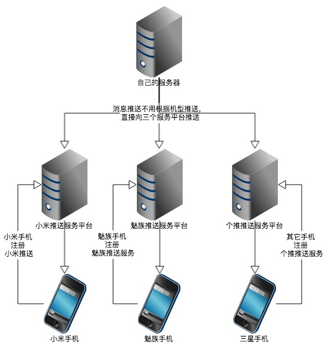

[](https://jitpack.io/#joyrun/MixPush)

### MixPush SDK融合多家推送平台，小米推送、魅族推送、个推等，在MIUI和Flyme OS共享系统级推送，杀死APP也能收到推送消息。

消息推送是App运营的重要一环，为了优化消息推送成功率，降低电量和流量消耗，系统级的推送服务显得尤为重要。小米和魅族由此推出了自家的推送平台，在MIUI和Flyme上共享系统级推送服务，让APP在被杀死的情况下也能正常收到推送消息。以后也会有越来越多的手机厂商会推出自己的推送平台，MixPush由此而生，降低开发者集成多家推送的开发成本，提高推送的到达率。


#### 推荐推送平台
##### 小米推送
支持所有的Android平台，特点是在MIUI系统上共享系统级推送，APP被杀死也可以收到通知栏推送。
https://dev.mi.com/console/appservice/push.html
##### 魅族推送
仅仅支持Flyme系统，不能在非Flyme系统上使用，特点是在Flyme系统共享系统级推送，APP被杀死也可以收到通知栏推送。
https://open.flyme.cn/open-web/views/push.html

https://github.com/MEIZUPUSH/PushDemo
##### 个推推送
Android平台上最大的第三方推送平台，推送消息稳定。
http://www.getui.com/cn/index.html

##### 原理图
 
##### 原理分析
MixPush只是一个降低集成多家推送服务的框架，自身不拥有推送功能，所有的推送功能都是依靠各个推送平台来实现。从原理图可以看到，客户端APP会根据不同的手机注册不同的推送平台，不能同时注册两个推送服务，避免重复收到推送。而服务端不用考虑需要推送消息的用户手机属于何种平台，一律向各个平台发起推送，而客户端会根据注册的平台只会收到单一平台的推送消息。


#### Android客户端配置
添加仓库地址，修改根目录的build.gradle文件：
```
	allprojects {
		repositories {
			...
			maven {url "http://mvn.gt.igexin.com/nexus/content/repositories/releases/"}
			maven { url 'https://jitpack.io' }
		}
	}
```
选择推送平台，如果没有可以参考源码自行实现，添加依赖：
```

dependencies {
    compile 'com.github.joyrun.MixPush:client-core:1.2.0' //必填
    compile 'com.github.joyrun.MixPush:client-mipush:1.2.0' // 小米推送
    compile 'com.github.joyrun.MixPush:client-getui:1.2.0' // 个推
    compile 'com.github.joyrun.MixPush:client-meizu:1.2.0' // 魅族推送，魅族推送只支持Flyme系统，务必需要注意
}
```
创建一个继承MixPushIntentService的服务类，用于接收事件：

```

public class PushIntentService extends MixPushIntentService {
    @Override
    public void onReceivePassThroughMessage(MixPushMessage message) {
        Log.e(TAG, "收到透传消息 -> " + message.getContent());
    }

    @Override
    public void onNotificationMessageClicked(MixPushMessage message) {
        Log.e(TAG, "通知栏消息点击 -> " + message.getContent());
    }
}
```
配置AndroidManifest.xml，注册服务类
```
<manifest>
    <application ...>
        ...
        <service android:name=".PushIntentService"/>
    </application>
</manifest>
```


在Application类进行初始化，如果没有请自行创建：
```
public class DemoApplication extends Application {
    public static final String MEIZU_APP_ID = "<MEIZU_APP_ID>";
    public static final String MEIZU_APP_KEY = "<MEIZU_APP_KEY>";
    public static final String MIPUSH_APP_ID = "<MIPUSH_APP_ID>";
    public static final String MIPUSH_APP_KEY = "<MIPUSH_APP_KEY>";
    
    @Override
    public void onCreate() {
        super.onCreate();
        initPush();
    }
    private void initPush() {
        MixPushClient.addPushManager(new MeizuPushManager(MEIZU_APP_KEY, MEIZU_APP_ID));
        MixPushClient.addPushManager(new MiPushManager(MIPUSH_APP_ID, MIPUSH_APP_KEY));
        MixPushClient.addPushManager(new GeTuiManager());
        MixPushClient.setPushIntentService(PushIntentService.class);
        MixPushClient.setSelector(new MixPushClient.Selector() {
            @Override
            public String select(Map<String, MixPushManager> pushAdapterMap, String brand) {
                // return GeTuiManager.NAME;
                //底层已经做了小米推送、魅族推送、个推判断，也可以按照自己的需求来选择推送
                return super.select(pushAdapterMap, brand);
            }
        });
        // 配置接收推送消息的服务类
        MixPushClient.setPushIntentService(PushIntentService.class);
        // 注册推送
        MixPushClient.registerPush(this);
        // 绑定别名，一般是填写用户的ID，便于定向推送
        MixPushClient.setAlias(this, getUserId());
        // 设置标签，用于对用户进行划分
        MixPushClient.setTags(this,"广东");
    }
    private String getUserId(){
        return "103";
    }
}
```
修改APP的build.gradle文件，配置个推的APP ID等信息

```
android {
    defaultConfig {
        ...
        manifestPlaceholders = [
                GETUI_APP_ID : "<GETUI_APP_ID>",
                GETUI_APP_KEY : "<GETUI_APP_KEY>",
                GETUI_APP_SECRET : "<GETUI_APP_SECRET>",
                PACKAGE_NAME: "<APP的包名>"
        ]
    }
}
```
#### 定制通知栏通知的图标
##### 小米推送

目前通知类的消息， 通知的图标展示规则如下：

1. 如果app中同时存在名为mipush_notification和mipush_small_notification的drawable文件，则使用mipush_notification的drawable作为通知的大图标，mipush_small_notification的drawable作为通知的小图标。
2. 如果app中只存在其中一个drawable文件，则使用该drawable作为通知的图标。
3. 如果app中不存在这两个drawable文件，则使用app的icon作为通知的图标。在MIUI中，通知栏图标统一显示为app的icon，不可以定制。

##### 个推推送

为了修改默认的通知栏顶部提示小图标，请在资源目录的res/drawable-ldpi/、res/drawable-mdpi/、res/drawable-hdpi/、res/drawable-xhdpi/、res/drawable-xxhdpi/等各分辨率目录下，放置相应尺寸的文件名为`push.png`图片。
```
ldpi:    48*48
mdpi:    64*64
hdpi:    96*96
xhdpi:   128*128
xxhdpi:  192*192
```

##### 魅族推送
和小米推送的一样。

#### 注意
1. 魅族推送只支持Flyme系统，务必需要注意。


### 服务端配置测试
目前只有Java的服务端代码，如果服务端使用其它语言，请参考设计思路自己开发。

复制代码和jar包到项目。

##### 服务端推送测试

```
public class MixPushServerTest {
    public static final String APP_PACKAGE_NAME = "<APP的包名>";
    public static final String MIPUSH_APP_SECRET_KEY = "<MIPUSH_APP_SECRET_KEY>";

    public static final Long MEIZU_APP_ID = <MEIZU_APP_ID>;
    public static final String MEIZU_APP_SECRET_KEY = "<MEIZU_APP_SECRET_KEY>";

    public static final String GETUI_APP_ID = "<GETUI_APP_ID>";
    public static final String GETUI_APP_KEY = "<GETUI_APP_KEY>";
    public static final String GETUI_MASTER_SECRET = "<GETUI_MASTER_SECRET>";
    public static final String GETUI_URL = "http://sdk.open.api.igexin.com/apiex.htm";
    static {
        MixPushServer.addPushServerManager(new MiPushServerManager(APP_PACKAGE_NAME, MIPUSH_APP_SECRET_KEY));
        MixPushServer.addPushServerManager(new MeizuPushServerManager(MEIZU_APP_ID, MEIZU_APP_SECRET_KEY));
        MixPushServer.addPushServerManager(new GeTuiPushServerManager(GETUI_APP_ID, GETUI_APP_KEY, GETUI_MASTER_SECRET, GETUI_URL));
    }
    String title = "title";
    String description = "description";
    String json = "{\"name\":\"Wiki\",\"age\":24}";
    @Test
    public void sendNotifyToAll() throws Exception {
        MixPushServer.sendNotifyToAll(title, description, json);
    }
    @Test
    public void sendMessageToAll() throws Exception {
        MixPushServer.sendMessageToAll(json);
    }
    @Test
    public void sendMessageToAlias() throws Exception {
        MixPushServer.sendMessageToAlias("100", json);
    }
    @Test
    public void sendMessageToTags() throws Exception {
        MixPushServer.sendMessageToTags("广东", json);
    }
    @Test
    public void sendNotifyToAlias() throws Exception {
        MixPushServer.sendNotifyToAlias("100", title, description, json);
    }
    @Test
    public void sendNotifyToTags() throws Exception {
        MixPushServer.sendNotifyToTags("广东", title, description, json);
    }
}
```
如果你不是使用以上三个推送，也可以根据接口自己来实现。


