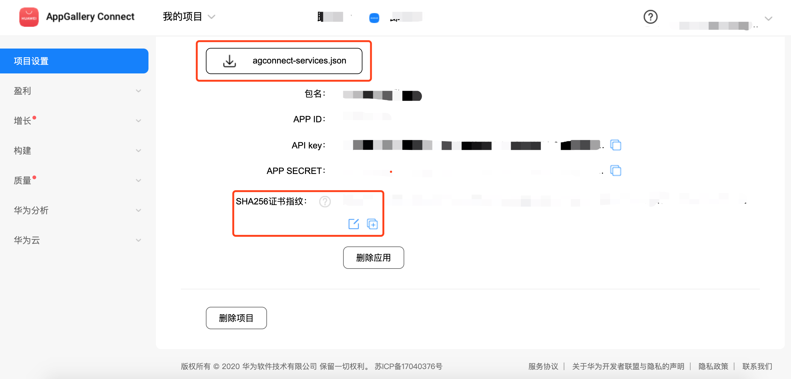

## MixPush：混合推送SDK，快速集成6个厂商推送，共享系统推送通道，杀死也能收到推送，推送到达率90%以上
基于 [统一推送联盟](http://chinaupa.com/) 的思想，快速集成了五个厂商的推送平台，共享系统的厂商推送通道，避免APP需要长期在后台运行，杀死APP也能收到推送，大大提高推送到达率。接入有一定的开发成本，需要前后端一起参与才可以完成，如果遇到什么问题可以发Issue提问解答。

1. 开发者只需要少量代码即可集成 小米、华为、魅族、OPPO、VIVO的厂商推送；

2. 会根据手机厂商推送的支持情况智能选择不同的推送；

3. 共享系统推送通道，杀死APP也能收到推送，推送到达率高达90%以上；

4. 提供服务端的Java代码，方便开发者快速实现服务端；

5. SDK已经为开发者考虑好各种问题，避免碰壁，从2人超一周开发时间压缩到只需要半天时间即可。

6. 提供Flutter插件，支持Android 和 iOS。

     

> 本SDK不支持商业推送平台，因为第三方商业推送SDK的免费版本基本都存在黑产行为，偷偷给用户推送通知栏广告，诱导用户下载其他APP或打开其他APP，非法获利。
>
> 这一点我们已经亲身经历过，我们集成的国内排名前三的推送平台就对我们公司的APP下了毒手，618的时候偷偷给用户发伪造成拼多多、淘宝、京东、微博的通知栏消息，诱导用户打开电商APP领红包，我们通过源码分析查证了，并且他们的商务已经向我公司道歉，所以切莫使用免费的商业推送SDK。


#### 推送平台介绍

| 推送平台                                                     | 透传   | 全局推送 | 别名/标签 | 支持说明                                                     |
| ------------------------------------------------------------ | ------ | -------- | --------- | ------------------------------------------------------------ |
| [小米推送](https://dev.mi.com/console/appservice/push.html)  | 支持   | 支持     | 支持      | 支持所有Android设备，小米设备支持系级别推送，其它设备支持普通推送 |
| [华为推送](https://developer.huawei.com/consumer/cn/console) | 支持   | 不支持   | 不支持    | 仅华为设备，部分EMUI4.0和4.1，及EMUI5.0及之后的华为设备。    |
| [OPPO推送](https://push.oppo.com)                            | 不支持 | 不支持   | 支持      | 仅OPPO和一加手机，支持ColorOS3.1及以上的系统。               |
| [VIVO推送](https://dev.vivo.com.cn/openAbility/pushNews)     | 不支持 | 支持     | 支持      | 仅VIVO手机，部分 Android 9.0，及 9.0 以上手机                |
| [魅族推送](http://open-wiki.flyme.cn/doc-wiki/index#id?129)  | 不支持 | 支持     | 支持      | 仅魅族手机，Flyme系统全平台                                  |
| APNs                                                         | 不支持 | 不支持   | 不支持    | 仅苹果设备                                                   |
| [小米推送 APNs](https://dev.mi.com/console/appservice/push.html) | 不支持 | 支持     | 支持      | 仅苹果设备，代替APNs，可以有效降低服务器压力                 |
##### 建议

1. 如果手机支持建厂商推送就使用厂商推送SDK，否则使用小米推送。
2. 由于华为推送不支持别名和标签，所以建议所有的手机都统一通过regId进行推送。
3. 由于多数的推送SDK不支持透传，如果APP需要支持透传，建议统一使用小米推送作为透传方案，但是如果使用小米作为所有Android手机的透传功能，那么小米推送就不再支持全局推送。
4. 由于部分推送不支持全局推送，如果要推送给所有用户，请查询最近3个月有打开APP的用户，进行分组推送。
5. 建议 iOS 也使用[小米推送](https://dev.mi.com/console/doc/detail?pId=98)，可以有效降低服务器的推送压力，特别是在全局推送和分组推送的时候。


### 注册各大的推送平台的账号

这个步骤在这里就不详细展开说了，自行注册配置，除了小米推送外，其它推送都必须要公司主体才可以申请，请务必注意，避免浪费时间。

## Android 客户端配置

#### 修改项目的根目录 build.gradle

```groovy
buildscript {
    repositories {
      	...
        jcenter()
        maven { url 'http://developer.huawei.com/repo/' }
    }
    dependencies {
        ...
        classpath 'com.huawei.agconnect:agcp:1.3.1.300'
    }
}
allprojects {
    repositories {
        ...
        jcenter()
        maven { url 'http://developer.huawei.com/repo/' }
    }
}
```
#### 修改 app 目录的 build.gradle 

小米、VIVO和魅族需要在推送管理后台创建项目并且把对应的APP_ID和APP_KEY配置到文件中，OPPO比较特殊，是配置 APP_KEY 和 APP_SECRET。

```groovy
apply plugin: 'com.huawei.agconnect'
android {
    compileSdkVersion 29
    defaultConfig {
        ...
        manifestPlaceholders["VIVO_APP_ID"] = "<VIVO_APP_ID>"
        manifestPlaceholders["VIVO_APP_KEY"] = "<VIVO_APP_KEY>"
        manifestPlaceholders["MI_APP_ID"] = "<MI_APP_ID>"
        manifestPlaceholders["MI_APP_KEY"] = "<MI_APP_KEY>"
        manifestPlaceholders["OPPO_APP_KEY"] = "<OPPO_APP_KEY>"
        manifestPlaceholders["OPPO_APP_SECRET"] = "<OPPO_APP_SECRET>"
        manifestPlaceholders["MEIZU_APP_ID"] = "<MEIZU_APP_ID>"
        manifestPlaceholders["MEIZU_APP_KEY"] = "<MEIZU_APP_KEY>"
    }
}
dependencies {
    implementation 'com.mixpush:mixpush-core:2.0.1'// 核心包
    implementation 'com.mixpush:mixpush-mi:2.0.1' // 小米推送
    implementation 'com.mixpush:mixpush-meizu:2.0.1' // 魅族推送
    implementation 'com.mixpush:mixpush-huawei:2.0.1' // 华为推送
    implementation 'com.mixpush:mixpush-oppo:2.0.1' // OPPO推送
    implementation 'com.mixpush:mixpush-vivo:2.0.1' // VIVO推送
}
```

#### 华为推送

华为推送麻烦一些，需要做3步配置：

1. 参考[官方文档](https://developer.huawei.com/consumer/cn/doc/development/HMS-Guides/Preparations)下载 `“agconnect-services.json”`并拷贝到app目录。
2. 配置SHA256证书指纹，否则会提示 **错误 6003 **，详细查看[通用错误码](https://developer.huawei.com/consumer/cn/doc/development/HMS-2-References/hmssdk_huaweipush_api_reference_errorcode)。
3. 配置指纹证书，否则会提示 **错误 907135702**，详细查看[通用错误码](https://developer.huawei.com/consumer/cn/doc/development/HMS-2-References/hmssdk_huaweipush_api_reference_errorcode)。





#### 初始化
定义监听器

```java
public class MyUnifiedPushReceiver extends UnifiedPushReceiver {

    @Override
    public void onRegisterSucceed(Context context,PushPlatform platform) {
        // 这里需要实现上传regId和推送平台信息到服务端保存。
    }

    @Override
    public void onNotificationMessageClicked(Context context, UnifiedPushMessage message) {
        // 通知栏消息点击触发，实现打开具体页面，打开浏览器等。
    }
}
```

在Application初始化

```java
// 开启日志
//UnifiedPush.getInstance().setLogger(new PushLogger(){});
UnifiedPush.getInstance().setPushListener(new MyUnifiedPushReceiver());
// 默认初始化5大推送平台（小米推送、华为推送、魅族推送、OPPO推送、VIVO推送）
UnifiedPush.getInstance().register(this);
```

1. 务必在 onRegisterSucceed 实现上传 RegId 到服务端。
2. 请在 onNotificationMessageClicked 实现对通知栏的操作，比如打开浏览器、跳转某个页面。


#### 混淆配置

```
# MixPush
-keep class com.mixpush.mi.MiPushProvider {*;}
-keep class com.mixpush.meizu.MeizuPushProvider {*;}
-keep class com.mixpush.huawei.HuaweiPushProvider {*;}
-keep class com.mixpush.oppo.OppoPushProvider {*;}
-keep class com.mixpush.vivo.VivoPushProvider {*;}
 
# 华为推送
-keep class com.hianalytics.android.**{*;} 
-keep class com.huawei.updatesdk.**{*;} 
-keep class com.huawei.hms.**{*;}

# 小米推送


# OPPO
-keep public class * extends android.app.Service
-keep class com.heytap.msp.** { *;}

# VIVO
-dontwarn com.vivo.push.** 
-keep class com.vivo.push.**{*; } 
-keep class com.vivo.vms.**{*; }

# 魅族

```


## Java 服务端配置

1. 支持全局推送、单条推送、分组推送。
2. 建议客户端每次打开APP的时候，都请求api登记RegId更新，并记录最后修改时间，无论regId是否有修改。
3. **由于华为和苹果推送不支持全局推送，需要从数据库查询全部的RegId进行分组推送。**
4. **超过3个月没有打开APP，建议不要推送，避免浪费资源，特别是全局推送的时候。**


##### 添加依赖

```xml
<repositories>
    <repository>
        <id>mixpush</id>
        <url>https://dl.bintray.com/mixpush/maven/</url>
    </repository>
</repositories>
<dependencies>
    <dependency>
        <groupId>com.mixpush</groupId>
        <artifactId>mixpush-sender</artifactId>
        <version>2.0.1</version>
        <type>pom</type>
    </dependency>
</dependencies>
```

##### 示例

```java
class MixPushServerExample {
    public static void main(String[] args) {
        UnifiedPushSender sender = new UnifiedPushServer.Builder()
                .packageName("<packageName>")
                .mi("<appSecretKey>")
                .meizu("<appId>", "<appSecretKey>")
                .huawei("<appId>", "<appSecretKey>")
                .oppo("<appKey>", "<masterSecret>")
                .vivo("<appId>", "<appKey>", "<appSecretKey>")
          		//.miAPNs("<appSecretKey>")
                .build();
        MixPushMessageConfig activitiesMessageConfig = new MixPushMessageConfig.Builder()
         		 // OPPO 必须在“通道配置 → 新建通道”模块中登记通道，再在发送消息时选择
          		 .oppoPushChannelId("activities")
           		 .build();
        UnifiedPushMessage message = new UnifiedPushMessage.Builder()
                .title("这里是标题")
                .description("这里是副标题")
                .payload("{\"url\":\"http://github.com/taoweiji\"}")
          		.config(activitiesMessageConfig)
                .build();
      	UnifiedPushTarget target = UnifiedPushTarget.single("mi","xxxx");
        sender.sendNotificationMessage(message,target);
    }
}
```

##### MixPushMessageConfig

|                     |                                                              |
| ------------------- | ------------------------------------------------------------ |
| channelId           | 作废                                                         |
| vivoSystemMessage   | false：运营类消息，true：系统类消息                          |
| timeToLive          | 非必填，消息有效期，最长72小时，单位：毫秒                   |
| miPushChannelId     | 非必填，由于普通消息内日推送数量有限，如果是IM、订单变化等消息可以向[小米官方申请](https://dev.mi.com/console/doc/detail?pId=2086#faq-permission) |
| oppoPushChannelId   | 必填，必须在“通道配置 → 新建通道”模块中登记通道，[OPPO渠道适配](https://open.oppomobile.com/wiki/doc#id=10289) |
| huaweiPushChannelId | 非必填，                                                     |

##### MixPushMessage

|             |                                            |
| ----------- | ------------------------------------------ |
| title       | 通知栏标题，如果passThrough是false，必填   |
| description | 通知栏副标题，如果passThrough是false，必填 |
| payload     | 必须是json格式                             |
| passThrough | false：通知栏推送，true：透传消息          |
| messageId   | 非必填，会默认生成一个，用于追踪Result     |
| config      | 必填，配置ChannelId等信息                  |

### 问题汇总

##### [小米推送](https://dev.mi.com/console/doc/detail?pId=863)

2. MIUI日联网设备数≥10000时，当日可推送`普通消息`数量为MIUI日联网设备数*5。
3. `普通消息`每日推送数量有限，如果需要开发即时聊天/订单变化，请申请[通知消息权限](https://dev.mi.com/console/doc/detail?pId=2086#faq-permission)，发送数量不受限制。

##### [OPPO推送](https://open.oppomobile.com/wiki/doc#id=10194)

1. 目前单日推送数量为：累计注册用户数\*2。
2. 目前私信处于公测阶段，需要申请才能开启私信通道，私信申请请参考[OPPO PUSH通道升级公测邀请](https://open.oppomobile.com/wiki/doc#id=10614)。
3. 必须在“通道配置 → 新建通道”模块中[登记通道](https://open.oppomobile.com/wiki/doc#id=10289)，再在发送消息时选择。

##### [VIVO推送](https://dev.vivo.com.cn/documentCenter/doc/156)

1. 目前vivo手机接收的消息为7:00-23:00，服务器允许推送时间为7:00-22:00，系统消息不受此时间限制。
2. 用户单应用每日运营消息接收条数上限5条，系统消息无限制。
3. 正式消息分为运营消息和系统消息，两者每日限制发送量均根据SDK订阅数推算，SDK订阅数小于10000，按10000计数；大于10000，则等于SDK订阅数。

##### 魅族推送


##### 华为推送

1. 不支持全局推送，需要从数据库查询所有的regId进行推送，建议不要查询超过3个月没有打开APP的regId，降低推送压力。


##### 小米推送 APNs服务

1. 不支持透传功能。
2. 推荐用来代替APNs，可以有效降低服务器推送压力。

##### APNs

1. 不支持全局推送。


##### 通知栏渠道匹配

- [Android 通用渠道适配](https://developer.android.com/training/notify-user/channels)
- [华为渠道适配](https://developer.huawei.com/consumer/cn/doc/development/HMS-Guides/push-other#channel_id)
- [OPPO渠道适配](https://open.oppomobile.com/wiki/doc#id=10289)
- [vivo推送消息分类功能说明](https://dev.vivo.com.cn/documentCenter/doc/359)
- 魅族不支持配置渠道
- [小米推送适配渠道](https://dev.mi.com/console/doc/detail?pId=2086#faq-permission) 


##### 透传消息

1. 默认不开启透传功能，需要手动开启。
2. iOS不支持透传功能。
3. MixPush推荐使用小米推送作为统一的透传功能，但是如果开启小米推送作为默认透传，将无法使用小米进行全局推送，因为会导致非小米手机推送2条推送，必须走分组推送。


## 测试报告
mi代表使用小米推送，huawei代表是使用华为推送。ok代表通过、- 代表没有测试设备、error代表异常。
|        | 小米手机 | 华为手机 | 魅族手机 | OPPO手机 | VIVO手机 | 一加手机 |
| ------ | -------- | -------- | -------- | -------- | -------- | --------  |
| 4.4 | mi, ok | mi, ok | mi, ok | mi, ok | mi, ok | -  |
| 5.0   | mi, ok | huawei, ok | meizu, ok | oppo, ok | vivo, ok | oppo, ok |
| 6.0   | mi, ok | huawei, ok | meizu, ok | oppo, ok | vivo, ok | - |
| 7.0   | mi, ok | huawei, ok | meizu, ok | oppo, ok | vivo, ok | oppo, ok |
| 8.0   | mi, ok | huawei, ok | meizu, ok | oppo, ok | vivo, ok | oppo, ok |
| 9.0   | mi, ok | huawei, ok | meizu, ok | oppo, ok | vivo, ok | oppo, ok |
| 10.0   | mi, ok | huawei, ok | meizu, ok | oppo, ok | vivo, ok | oppo, ok |


### TODO

- 支持Google FCM
- 提供Flutter插件，支持Android 和 iOS。
- 清理通知栏的工具
- 实现消息回执功能
- 平滑推送
- 定时推送
- 支持透传
- 通知栏重要等级